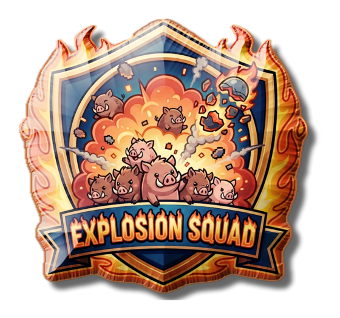
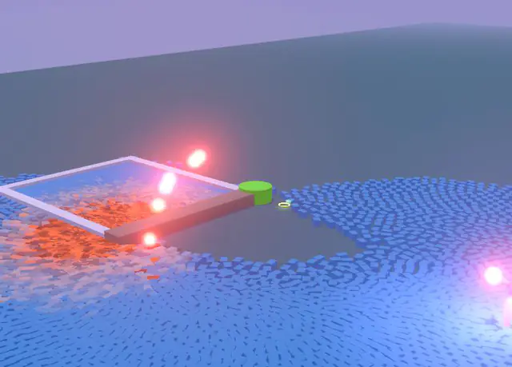
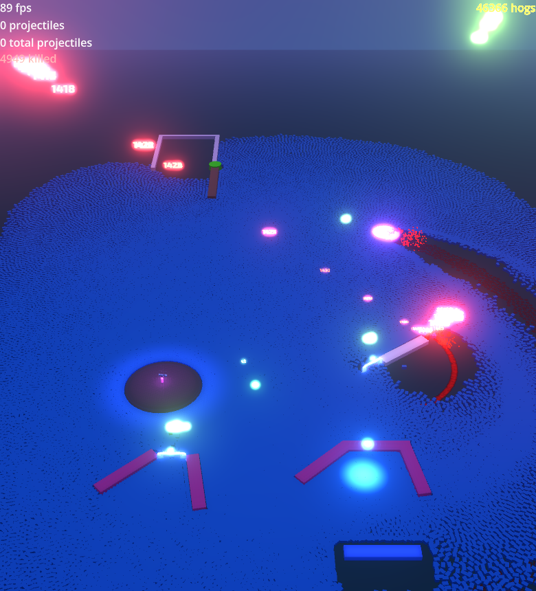
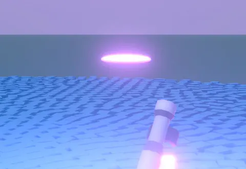
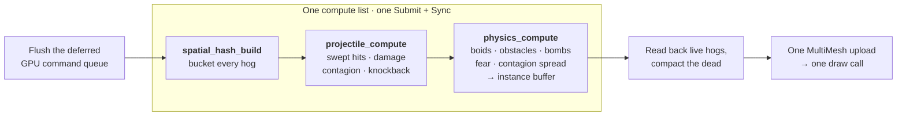
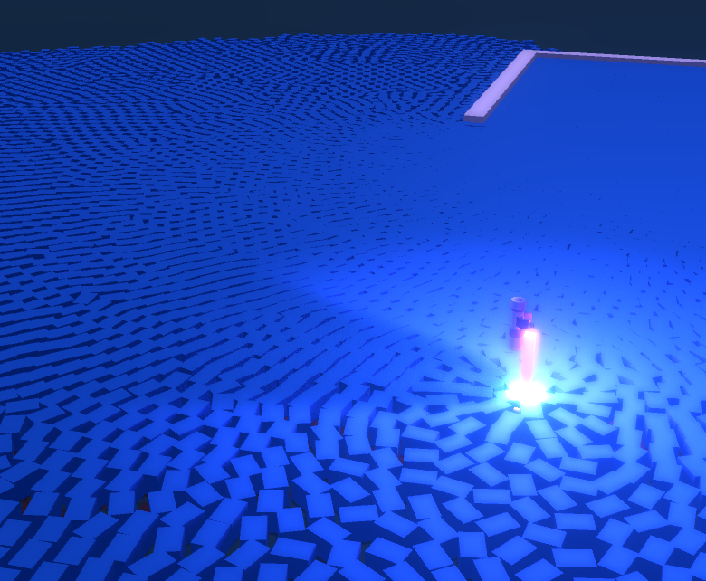

<div align="center">



# Explosion Squad

**A GPU-simulated crowd of tens of thousands of hogs, and a blaster to lob things at them.**

[](https://godotengine.org/)
[](#-how-it-works)
[](#-how-it-works)
[](#-how-it-works)
[](LICENSE)



<sub><kbd>Shift</kbd> + <kbd>6</kbd> with fire, poison and drunk lobs mixed in: every shell is solved to land on the cursor.</sub>

[What's new](#-whats-new) · [How many hogs?](#-how-many-hogs) · [Features](#-whats-in-the-box) · [Arsenal](#-the-arsenal) · [Controls](#-controls) · [How it works](#-how-it-works) · [Running it](#-running-it) · [Performance](#-performance-notes)

</div>

---

Every hog is simulated on the GPU: flocking, obstacle avoidance, panic, contagion, damage, all of it
in compute shaders. The CPU never positions a hog; it only reads them back to draw them in a single
MultiMesh draw call. `Main.tscn` ships with **10,000 hogs**; **50,000** still run in real time, and
the simulation keeps going at 100,000, just no longer in real time.

> Built mainly to see how far you can push Godot's compute shader support before the GPU gives up.
> It hasn't yet.

## 🐷 How many hogs?

<div align="center">


<sub>50,000 hogs scattered across the map, seen from far out: 89 fps with every hog drawn and
shadowed. The HUD counts the 46,366 still standing ten seconds in.</sub>
</div>

Measured on an Apple M4 Pro (Metal, Forward+), with `Main.tscn` as shipped and the hogs scattered
across the map:

| Hogs | Frame time, as shipped | Simulation only (hogs hidden) | Real time? |
|---:|---|---|:---:|
| 20,000 | 8.4 ms (120 fps, the display cap) | 8.3 ms (display cap) | ✅ |
| 50,000 | 11.5 ms (87 fps) | 8.5 ms (118 fps) | ✅ |
| 75,000 | 60.7 ms (16 fps) | 11.8 ms (85 fps) | ⚠️ drawing tips it over |
| 100,000 | 180 ms (6 fps) | 143 ms (7 fps) | ❌ |

Past about 50,000 the cost falls off a cliff instead of growing smoothly. Physics runs at a fixed
60 Hz, so once a frame takes longer than a tick, Godot runs extra ticks to catch up, and here each
tick is a full GPU dispatch and sync. At 100,000 hogs one tick costs ~17.6 ms, just over the
16.7 ms budget, so every frame runs the maximum of 8 ticks.

## ✨ What's new

| | |
|---|---|
| 🎯 **Lob anything** | Hold <kbd>Shift</kbd> with any fire key and the shot is lobbed onto the cursor. A ballistic solver picks the launch speed, so shells land where you aim at any range. |
| 💣 **Mortar** | <kbd>6</kbd> fires an explosive shell on a 55° arc that bursts on impact, with the same shockwave, damage falloff and panic as a dropped bomb. |
| 🔫 **Head hog aims the shot** | While lobbing, the blaster on the head hog pitches up to the launch angle and eases back when you let go. |
| 🚀 **Projectile overhaul** | Swept hits (fast shots can't pass through a hog between frames), smooth interpolated flight, per-ability fire rate, spread and muzzle-speed variance, gravity per projectile, and shots that expire instead of flying forever. |
| 🦠 **Contagion that ends** | Fire, poison and drunk each run on their own clock, pass on a shorter dose at every hop, and wear off, taking the colour tint with them. |
| 🪂 **Airborne hits** | Hogs knocked into the air can now be hit too. |
| 🧱 **Solid walls** | Hog contacts use the drawn mesh's footprint, so hogs no longer sink into walls, and hollow shapes like the play pen are split into their real walls. |
| 🗺️ **Sharper neighbour grid** | The spatial hash is now a wrap-around grid with a 16-bit frame stamp: no collisions between distant cells, and no stale neighbours left behind. |

## 📦 What's in the box

|  |  |
|---|---|
| 🐷 **Boids on the GPU** | Separation, alignment and cohesion for the whole crowd, with O(1) neighbour lookups |
| ⚡ **3 compute passes per frame** | Spatial hash → projectiles → physics, which also writes the MultiMesh buffer |
| 🔫 **6 projectile types** | Bullet, fire, poison, drunk, teleport and mortar, each lobbable with <kbd>Shift</kbd> |
| 🦠 **Contagion** | Fire, poison and alcohol spread hog to hog, shorter-lived at each hop, and expire |
| 💣 **Bombs and explosions** | Radius blast with damage falloff and fear impulses that send the crowd into a panic |
| 😱 **Death fear** | Hogs near a death briefly scatter |
| 🔢 **Floating damage numbers** | Lerped from 3D world space to 2D screen positions |
| 🖍️ **Post-process outline** | Depth-based edge detection in a compositor effect |
| 🕳️ **Black hole bomb** | Doppler, warp and accretion-disc shader |
| 🎨 **Drawable ground** | Impact decals baked from rotated and tinted textures at startup, at no per-frame cost |
| 📈 **Trajectory preview** | A parabolic aim guide at 120 Hz |

## 🔫 The arsenal

Hold a key to keep firing; each ability has its own fire rate, spread and muzzle-speed variance.

| Key | | Projectile | What it does |
|:---:|:---:|---|---|
| <kbd>1</kbd> | 🟡 | **Bullet** | 50 damage and a hard knockback; about 20 shots a second |
| <kbd>2</kbd> | 🔴 | **Fire** | Sets hogs alight for 15 s (0.5 DPS), spreading to neighbours |
| <kbd>3</kbd> | 🟢 | **Poison** | Pops hogs upward and poisons them for 20 s (0.2 DPS), spreading |
| <kbd>4</kbd> | 🟣 | **Drunk** | Hogs stagger for 50 s (0.3 DPS), passing it around |
| <kbd>5</kbd> | 🔵 | **Teleport** | Beams the hog it hits over to the teleport marker and pops it into the air |
| <kbd>6</kbd> | 🟠 | **Mortar** | Lobbed at 55°; bursts on impact over 3.5 m for 40 damage, with a shockwave and panic |
| <kbd>Shift</kbd> + any | ↗️ | **Lob** | The same projectile, lobbed onto the cursor instead of fired straight |

<table>
<tr>
<td width="50%"></td>
<td>

**Aim follows the shot.** While <kbd>Shift</kbd> or <kbd>6</kbd> is held, the head hog's blaster
pitches up to the launch angle: the lob angle for <kbd>Shift</kbd>, the mortar's own angle for
<kbd>6</kbd>. It uses the same smoothing as its normal cursor tracking, so it eases in and out
instead of snapping.

The shell leaves from the raised muzzle, and the solver aims from wherever the muzzle is, so it
still lands on the cursor.

</td>
</tr>
</table>

## 🎮 Controls

| Input | Action |
|---|---|
| <kbd>1</kbd> – <kbd>6</kbd> | Fire a projectile (hold to keep firing) |
| <kbd>Shift</kbd> + <kbd>1</kbd> – <kbd>6</kbd> | Lob it onto the cursor instead |
| Right-click | Toggle the head hog following the cursor; the crowd follows the head hog |
| Double-click, <kbd>Enter</kbd> or <kbd>Space</kbd> | Drop a bomb at the cursor |
| <kbd>S</kbd> (hold) | Spawn hogs at the cursor |
| <kbd>A</kbd> | Show / hide the hogs (the simulation keeps running) |
| <kbd>L</kbd> | Toggle per-hog state labels |
| <kbd>P</kbd> | Slow motion (eases to 0.1× time scale and back) |
| Drag | Orbit the camera |
| <kbd>Shift</kbd> + drag | Pan |
| Scroll / pinch | Zoom |
| <kbd>Esc</kbd> | Quit |

## 🧠 How it works

The language split is deliberate. **C#** handles anything that talks to the GPU: compute dispatch,
buffers, the MultiMesh, the projectile and bomb spawners, and mouse picking (about 30% faster than
the GDScript version). **GDScript** handles everything you see: projectile visuals, FX, UI, camera,
animation components and compositor effects.

Each physics frame runs as a single GPU submission:



- **Neighbour grid.** Hogs are bucketed into a 256 × 128 wrap-around grid of 2 m cells. Each bucket
  word carries a 16-bit frame stamp, so stale buckets reset lazily and there is never a clear pass.
  Hogs in the air go to a separate list that projectiles also scan.
- **Two copies, one path.** Every projectile is a visual node plus a GPU copy that does the damage.
  Both use the same velocity, gravity, ground height and semi-implicit Euler step on the same
  frames, so damage lands exactly where the shot you see lands. The node is drawn with physics
  interpolation, so streams of shots glide instead of stepping.
- **Contagion.** Each type stores an absolute expiry that only ever rises (`atomicMax`), so
  concurrent infections from neighbours are safe. The state bits are derived from the live types
  every frame, never stored.
- **Obstacles.** Spheres and cylinders become circles; boxes and convex hulls become oriented
  boxes. Trimeshes are decomposed into their real footprint, so a hollow pen stays hollow.

There used to be a fourth pass, `transform_compute.glsl`, that re-read every body only to build
the instance buffer. It was folded into the tail of `physics_compute`, where the body is already in
registers.

For the full engineering story (buffer layouts, invariants and gotchas), see
[AGENTS.md](AGENTS.md).

## 📸 Screenshots

| Hog crowd | Contagion spread |
|---|---|
|  |  |

| Bomb blast | Poisoned hogs |
|---|---|
|  |  |

<details>
<summary><b>🗂️ Project structure</b></summary>

```
Explosion-Squad-Game/
├── Main.tscn / Main.gd              # Entry point, fire keys 1–6, Shift lobs, head aim
├── Global.gd                        # Autoload — state enums + cross-system signals
├── compute_shaders/                 # C# GPU manager + 3 GLSL compute shaders
│   ├── SquadMultiMeshInstance3D.cs          # Orchestrator — types, fields, lifecycle
│   ├── SquadMultiMeshInstance3D.GpuSetup.cs # Setup, Dispose, push constants, RebuildXxx
│   ├── SquadMultiMeshInstance3D.GpuQueue.cs # Deferred GPU command queue (single drain point)
│   ├── SquadMultiMeshInstance3D.Obstacles.cs# Obstacle cache, OBB/circle emit, trimesh footprints
│   ├── SquadMultiMeshInstance3D.Projectiles.cs # Slot pool, SpawnProjectile, UploadPending
│   ├── SquadMultiMeshInstance3D.Bombs.cs    # Bomb buffer, Detonate, death FX pool, OnHogDied
│   ├── SquadMultiMeshInstance3D.TriggerZones.cs # Zone detection, deferred spawns
│   ├── SquadMultiMeshInstance3D.Labels.cs   # Distance-sorted label assignment
│   ├── spatial_hash_build.glsl                # Wrap-around grid + airborne list
│   ├── projectile_compute.glsl                # Swept projectile hits, damage, contagion
│   └── physics_compute.glsl                   # Boids, obstacles, bombs, contagion, instance write
├── projectiles/                     # GDScript visual projectiles + C# spawner facade
│   ├── ProjectilesSpawner.cs         # GDScript-callable C# facade (spawn, Detonate)
│   ├── ProjectileBase.gd             # Lockstep Euler flight, ballistic solver, interpolation
│   ├── ProjectileAbility.gd          # Resource class for ability data
│   └── *.tres                        # Bullet, Fire, Poison, Drunk, Teleport, Mortar
├── bombs/
│   └── BombSpawner.cs                # Spawns bomb visual + invokes DropBomb callback
├── components/                      # GDScript @tool components
│   ├── Animator.gd                   # 8 animation modes with editor preview
│   ├── GateAnimation.gd              # Opening / closing gates
│   └── LookAtTracker.gd              # Spring-physics smooth rotation, with an aim override
├── visuals/                         # GDScript FX
│   ├── Announce3D.gd                 # Floating damage numbers (3D → 2D)
│   ├── DrawableGround.gd             # Dynamic impact marks
│   ├── DeathFxScene.gd               # Particle FX, auto queue_free
│   └── HogLabels.gd                  # Label3D pool, no per-frame allocs
├── compositor_fx/                   # Post-process Outline effect (GDScript + GLSL)
├── shaders/                         # Visual-only gdshaders
│   ├── black_hole_3d.gdshader        # Bomb vortex (spin, warp, Doppler, accretion)
│   ├── openvat.gdshader              # Vertex Animation Texture for deformation
│   └── broken_tv.gdshader            # TV glitch effect
├── ui/                              # GDScript UI nodes
│   ├── Fps.gd                        # FPS + active projectile count
│   ├── HogsKilled.gd                 # Kill counter
│   ├── TotalHogs.gd                  # Live hog count
│   └── TrajectoryOverlay.cs          # 2D arc + 3D animated preview at 120 Hz
├── assets/
│   └── animal_hog_merged.tres        # Single-surface baked hog mesh (see Performance)
└── AGENTS.md                        # Architecture, layout, and instructions
```

</details>

## 🚀 Running it

Requires Godot 4.8-dev with C# / .NET support. `godotx` is a symlink to a source-compiled
master-branch binary; plain `godot` may be an older release that fails to open the project.

```bash
# Compile the C# assembly (after every C# edit)
dotnet build --nologo

# Open the editor
godotx --path .

# Run the main scene
godotx --path . res://Main.tscn

# Re-import after editing a .glsl file (a stale import silently leaves the pipeline invalid)
godotx --path . --import
```

> [!NOTE]
> The window is 780 × 1080 portrait, always-on-top, with HDR enabled. It works best on a discrete
> GPU; compute shaders don't exactly thrive on integrated graphics.

<details>
<summary><b>🎛️ Key tunable values</b></summary>

On `SquadMultiMeshInstance3D`, as `Main.tscn` ships them (they differ from the C# defaults):

```
NumBodies         = 10000   (C# default 5000)
BodyRadius        = 0.15
HogHealth         = 10      (C# default 100)
BombRadius        = 6       (C# default 15)
BombDamage        = 100     (C# default 80)
BombFearDuration  = 5s      (C# default 3s)
DebugHashOverflow = off     (1 Hz readback of dropped grid inserts — see Performance)
```

On `Main`, for the lob modifier:

```
lob_angle_deg     = 55      (launch elevation for Shift-lobbed shots)
lob_gravity_scale = 2.5     (× world gravity, so arcs come down fast)
```

Per projectile, on each `ProjectileAbility` resource: `speed`, `gravity_scale`,
`launch_angle_deg` (> 0 lobs it), `spread_deg`, `speed_variance`, `fire_interval`, `lifetime`
and `explosion_radius` / `_force` / `_damage`.

Boids parameters live in `physics_compute.glsl`:

```glsl
SEPARATION_PADDING = 3.0
ALIGNMENT_RADIUS   = 2.5
COHESION_RADIUS    = 5.0
```

</details>

## ⚡ Performance notes

The whole point of this project is that it stays fast. What makes that work:

- **MultiMesh instancing.** All hogs render in one draw call.
- **Single-surface baked hog mesh.** The Kenney source `.obj` shipped as 5 surfaces that all used
  the same material, so every hog cost 5 draw calls per pass, doubled by the shadow pass. Baked to
  `assets/animal_hog_merged.tres`: **41.4 → 34.1 ms/frame, ~18% faster, zero visual change.**
- **Wrap-around neighbour grid.** O(1) neighbour queries: 32,768 buckets × 64 entries. A 16-bit
  frame stamp in each bucket word invalidates stale buckets lazily, so there is no clear pass, and
  an oversized table costs *zero* per-frame time because nothing ever iterates it. Per-cell
  overflow is counted rather than silent; flip `DebugHashOverflow` if hogs start walking through
  each other in dense piles.
- **Merged transform pass.** The instance buffer is written from `physics_compute`'s tail as five
  coalesced `vec4` stores, not by a separate dispatch.
- **Deferred GPU command queue.** Every buffer mutation is recorded and applied from one drain
  point right before the dispatch. Buffer growth copies GPU→GPU with `BufferCopy` instead of
  reading back and merging on the CPU.
- **1.25× capacity growth and live-prefix readback.** Only the live hogs are read back, not the
  whole allocated capacity.
- **Obstacle broad-phase.** A conservative centre-distance reject in both obstacle loops.
- **Label3D pooling** and **pre-baked ground textures**, so neither allocates per frame.
- **Forward+ renderer**, chosen for the GPU-heavy workload.

<details>
<summary><b>📊 Where the frame time actually goes</b></summary>

Measured at ~20,000 hogs on an Apple M4 Pro (Metal, Forward+), averaging FPS over ~140 frames per
config. This was taken earlier, with the Kenney hog mesh; the scene now draws simpler boxes, so
today's numbers (see [How many hogs?](#-how-many-hogs)) are much lower.

| config | ms/frame |
|---|---|
| baseline | 41.4 |
| merged mesh (5 surfaces → 1) | 35.8 |
| shadows OFF | 15.5 |
| hogs hidden entirely | 11.7 |

So **shadow casting is ~26 ms (62% of the frame) and all compute is ~11.5 ms (27%).** That reframes
the whole optimization effort: three compute optimizations landed after this measurement
(capacity/readback, transform merge, obstacle broad-phase) and *none* produced a frame-time change
outside run-to-run noise. Obstacles in particular are essentially free: 3000 of them cost ~0.07 ms
with no broad-phase at all, because the array is small, cache-resident and broadcast-read, and the
work is pure ALU. The practical ceiling on obstacle count is gameplay, not performance: at 3000
obstacles the crowd bogs down to a quarter of its normal speed long before the GPU notices.

Two caveats worth knowing if you fork this:

- On Apple Silicon's unified memory the GPU→CPU→GPU round trip is a cheap memcpy, not bus
  traffic. Cutting it from 6.1 to 3.6 MB/frame changed nothing measurable. On a discrete GPU this
  would not be true.
- There is ~0.5% residual obstacle penetration at `PBD_ITERATIONS = 1` in a dense crowd. That is
  pre-existing solver behaviour, not a broad-phase artifact; it was verified unchanged with and
  without the reject.

</details>

## 🙏 Assets and attributions

- Hog characters, blasters and environment pieces from [Kenney](https://kenney.nl/) asset packs
  (mini-characters, blaster kit, modular space kit, cube pets). Great quality, very permissive
  license.
- `assets/animal_hog_merged.tres` is a surface-merged rebake of Kenney's `animal-hog.obj`: the same
  456 verts and AABB, one surface instead of five.
- [OpenVAT](https://openvat.org/) for vertex animation textures (#todo).
- Black hole shader courtesy of [hyperjragon](https://godotshaders.com/author/hyperjragon).
- Editor config based on the [Chickensoft Games C# template](https://github.com/chickensoft-games/EditorConfig).
- Screenshots and clips were captured in-engine; the clips with Godot's Movie Maker mode.

## 📄 License

MIT — see [LICENSE](LICENSE).

Do whatever you want with it. If you find the compute shader pipeline useful, great. If something
is broken, well, it worked on my machine.
