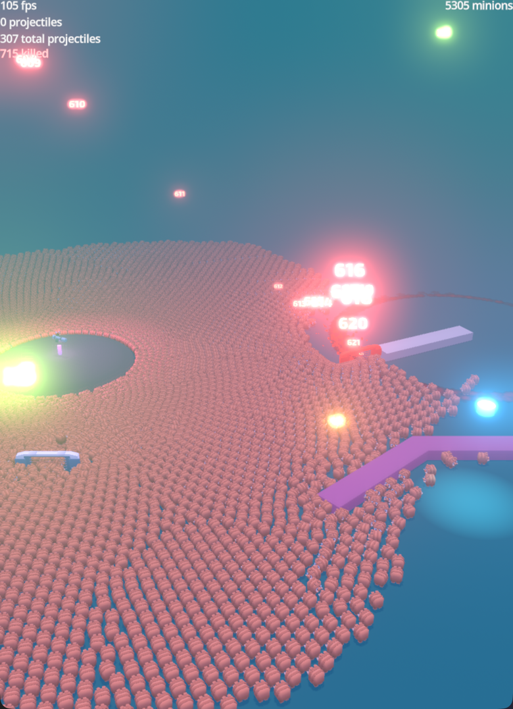
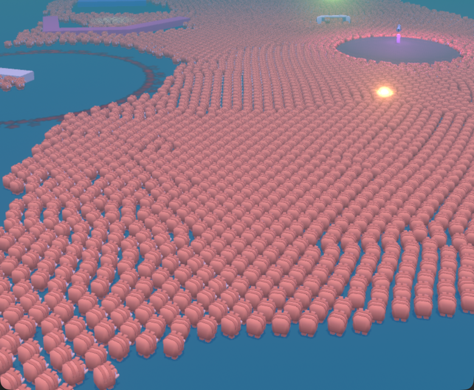
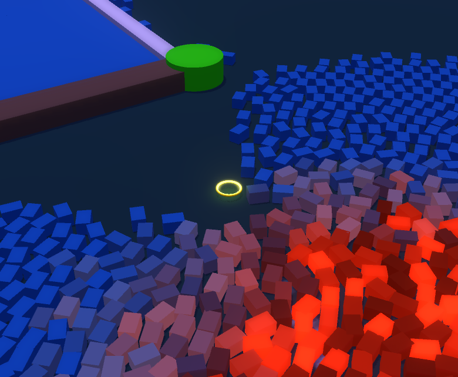
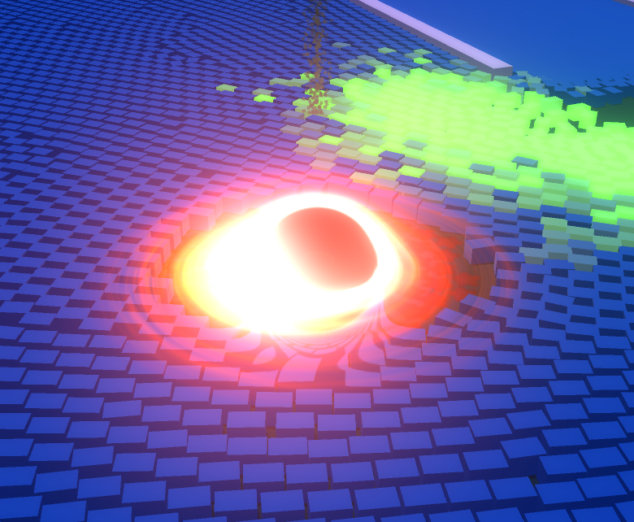
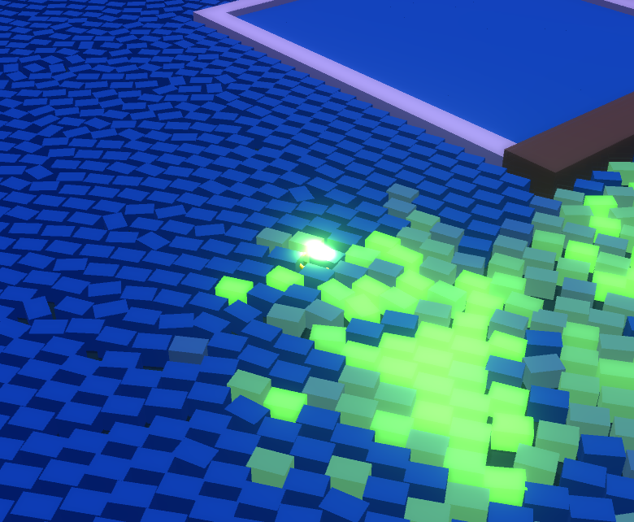

# Explosion Squad Godot Game Sandbox


A GPU-accelerated 3D action sandbox where you throw various projectiles at 20,000 simultaneously simulated hogs. All physics runs on the GPU via compute shaders — because doing it on the CPU would be a terrible idea.

> Built mainly to see how far you can push Godot's compute shader support before the GPU gives up. It hasn't yet.

---



---

## What's in the box

- **20,000 hogs** running boids AI with separation, alignment, and cohesion — all on the GPU
- **3 compute shader dispatches per frame**: spatial hashing → projectile physics → boids/bombs/contagion + MultiMesh transform write
- **5 projectile types** with distinct behaviors (see below)
- **Contagion system**: fire, poison, and alcohol spread between hogs, decaying along the chain
- **Bomb mechanics**: radius blast + fear impulses that send nearby hogs into a panic
- **Death fear**: hogs near a death event briefly scatter
- **Floating damage numbers** that lerp from 3D world space to 2D screen positions
- **Post-process outline** via depth-based edge detection compute shader
- **Black hole bomb** with Doppler, warp, and accretion disc shader effects
- **Drawable ground**: impact marks baked from rotated/tinted textures at startup — no per-frame cost
- **Parabolic trajectory preview** at 120 Hz so you can aim your shots

---

## Projectiles

| Key | Type | Behavior |
|-----|------|----------|
| `1` | Bullet | 50 damage, hard knockback |
| `2` | Fire | 2.0 DPS, spreads fire contagion |
| `3` | Poison | 1.0 DPS, adds upward force, spreads poison |
| `4` | Drunk | 0.3 DPS, staggers hogs, spreads alcohol contagion |
| `5` | Teleport | Grabs a hog at 75% health and throws it as a projectile |

---

## Architecture

The language split is intentional and worth explaining:

- **C#** handles anything that talks to the GPU: compute shader dispatch, MultiMesh, projectile spawning facade, bomb spawner, and mouse→3D world position conversion (a speed improvemnt of about 30% versus GDScript)
- **GDScript** handles everything else: visuals, UI, camera, animation components, compositor effects.

```
GPU Physics Pipeline (per frame)
─────────────────────────────────
1. spatial_hash_build.glsl    — neighbor lookup in O(1)
2. projectile_compute.glsl    — projectile integration + sphere collision + damage (atomic ops)
3. physics_compute.glsl       — boids AI + bomb forces + fear + contagion spread, then writes
                                the MultiMesh transform buffer in its own tail
```

All hogs render in a single draw call. The spatial hash makes neighbor queries O(1) instead of O(n²) — that part matters a lot at this scale.

There used to be a fourth pass, `transform_compute.glsl`, that re-read every body just to build the instance buffer. It was folded into the tail of `physics_compute` — the body data is already in registers at that point, so the extra dispatch, barrier and 112-byte-per-body re-read were pure overhead.

---

## Controls

| Key / Input | Action |
|-------------|--------|
| `1–5` | Spawn projectile type |
| `S` | Spawn hogs |
| `A` | Show/Hide hogs |
| `L` | Toggle per-hog state labels |
| `P` | Pause (0.1× time scale) |
| Mouse drag | Orbit camera |
| Shift + drag | Pan camera |
| Pinch / scroll | Zoom |

---

## Screenshots

| Hog crowd | Contagion spread |
|---|---|
|  |  |

| Bomb blast   | Poisoned hogs   |
|---|---|
|  |  |

---

## Project Structure

```
Explosion-Squad-Game/
├── Main.tscn / Main.gd              # Entry point, input dispatch
├── Global.gd                        # Autoload — state enums + cross-system signals
├── compute_shaders/                 # C# GPU manager + 3 GLSL compute shaders
│   ├── SquadMultiMeshInstance3D.cs          # Orchestrator — types, fields, lifecycle
│   ├── SquadMultiMeshInstance3D.GpuSetup.cs # Setup, Dispose, push constants, RebuildXxx
│   ├── SquadMultiMeshInstance3D.GpuQueue.cs # Deferred GPU command queue (single drain point)
│   ├── SquadMultiMeshInstance3D.Obstacles.cs# Obstacle cache, OBB/circle emit
│   ├── SquadMultiMeshInstance3D.Projectiles.cs # Slot pool, SpawnProjectile, UploadPending
│   ├── SquadMultiMeshInstance3D.Bombs.cs    # Bomb buffer, death FX pool, OnHogDied
│   ├── SquadMultiMeshInstance3D.TriggerZones.cs # Zone detection, deferred spawns
│   ├── SquadMultiMeshInstance3D.Labels.cs   # Distance-sorted label assignment
│   ├── spatial_hash_build.glsl                # O(1) spatial hash construction
│   ├── physics_compute.glsl                   # Boids, obstacles, bombs, contagion, instance write
│   └── projectile_compute.glsl                # Projectile integration + sphere collision
├── projectiles/                     # GDScript visual projectiles + C# spawner facade
│   ├── ProjectilesSpawner.cs         # GDScript-callable C# facade
│   ├── ProjectileBase.gd             # Semi-implicit Euler physics, GPU sync
│   ├── ProjectileAbility.gd          # Resource class for ability data
│   └── *.tres                        # ProjectileAbility resources per type
├── bombs/
│   └── BombSpawner.cs                # Spawns bomb visual + invokes DropBomb callback
├── components/                      # GDScript @tool components
│   ├── Animator.gd                   # 8 animation modes with editor preview
│   └── LookAtTracker.gd              # Spring-physics smooth rotation
├── visuals/                         # GDScript FX
│   ├── Announce3D.gd                 # Floating damage numbers (3D → 2D)
│   ├── DrawableGround.gd             # Dynamic impact marks
│   ├── DeathFxScene.gd               # Particle FX, auto queue_free
│   └── HogLabels.gd               # Label3D pool, no per-frame allocs
├── compositor_fx/                   # Post-process Outline effect (GDScript + GLSL)
├── shaders/                         # Visual-only gdshaders
│   ├── black_hole_3d.gdshader        # Bomb vortex (spin, warp, Doppler, accretion)
│   ├── openvat.gdshader              # Vertex Animation Texture for deformation
│   └── broken_tv.gdshader            # TV glitch effect
├── ui/                              # GDScript UI nodes
│   ├── Fps.gd                        # FPS + active projectile count
│   ├── HogsKilled.gd                 # Kill counter
│   ├── TotalHogs.gd                  # Live hog count
│   └── TrajectoryOverlay.cs          # 2D arc + 3D animated preview at 120 Hz
├── assets/
│   └── animal_hog_merged.tres        # Single-surface baked hog mesh (see Performance Notes)
└── AGENTS.md                        # Architecture, layout, and instructions
```

---

## Running It

Requires Godot 4.8-dev with C# / .NET support. `godotx` is a symlink to a source-compiled
master-branch binary; plain `godot` may be an older release that fails to open the project.

```bash
# Compile the C# assembly (do this after every C# edit)
dotnet build --nologo

# Open the editor
godotx --path .

# Run the main scene
godotx --path . res://Main.tscn

# Re-import after editing a .glsl file (see Performance Notes — a stale import
# silently leaves the pipeline invalid)
godotx --path . --import
```

Display is 780×1080 portrait, always-on-top, HDR enabled. Works best on a discrete GPU — compute shaders don't exactly thrive on integrated graphics.

---

## Key Tunable Values

These live in the inspector on `SquadMultiMeshInstance3D`. Values below are what `Main.tscn`
actually ships, which differs from the C# defaults:

```
NumBodies        = 20000   (C# default 5000)
BodyRadius       = 0.15
HogHealth        = 10      (C# default 100)
BombRadius       = 6
BombDamage       = 100
BombFearDuration = 5s
DebugHashOverflow = off    (1 Hz readback of dropped hash inserts — see Performance Notes)
```

Boids parameters are in `physics_compute.glsl`:

```glsl
SEPARATION_PADDING = 3.0
ALIGNMENT_RADIUS   = 2.5
COHESION_RADIUS    = 5.0
```

---

## Performance Notes

The whole point of this project is that it stays fast. A few things that make that work:

- **MultiMesh instancing** — all hogs in 1 draw call
- **Single-surface baked hog mesh** — the Kenney source `.obj` shipped as 5 surfaces that all
  rendered with the same material, so every hog cost 5 draw calls per pass, doubled by the
  shadow pass. Baked to `assets/animal_hog_merged.tres`: **41.4 → 34.1 ms/frame, ~18% faster,
  zero visual change.**
- **Spatial hashing** — O(1) neighbor queries, 32768 buckets × 64 entries. A frame-parity bit
  in the count word lazily invalidates stale buckets, so there is no clear pass and an
  oversized table costs *zero* per-frame time — nothing ever iterates it. Per-cell overflow is
  counted rather than silent; flip `DebugHashOverflow` if hogs start walking through each other
  in dense piles.
- **Merged transform pass** — the instance buffer is written from `physics_compute`'s tail
  instead of a separate dispatch, as five coalesced `vec4` stores.
- **Obstacle broad-phase** — a conservative centre-distance reject in both obstacle loops.
  Makes obstacle cost flat rather than linear, though see the honest note below.
- **Deferred GPU command queue** — every buffer mutation is recorded and applied from one
  drain point right before the dispatch, instead of scattered `BufferUpdate` calls from
  `_Process` and mid-loop. Buffer growth copies GPU→GPU via `BufferCopy` rather than reading
  back and merging on the CPU.
- **1.25× capacity growth + live-prefix readback** — only `NumBodies` instances are read back,
  not the whole allocated capacity.
- **Label3D pooling** — no allocs per frame
- **Pre-baked texture rotations** in `DrawableGround` — rotation pool built at startup
- **Forward Plus renderer** chosen for the GPU-heavy workload

### Where the frame time actually goes

Measured at ~20,000 hogs on an Apple M4 Pro (Metal, Forward+), averaging FPS over ~140 frames
per config:

| config | ms/frame |
|---|---|
| baseline | 41.4 |
| merged mesh (5 surfaces → 1) | 35.8 |
| shadows OFF | 15.5 |
| hogs hidden entirely | 11.7 |

So **shadow casting is ~26 ms (62% of the frame) and all compute is ~11.5 ms (27%).** That
reframes the whole optimization effort: three compute optimizations landed after this
measurement (capacity/readback, transform merge, obstacle broad-phase) and *none* produced a
frame-time change outside run-to-run noise. Obstacles in particular are essentially free —
3000 of them cost ~0.07 ms with no broad-phase at all, because the array is small,
cache-resident and broadcast-read, and the work is pure ALU. The practical ceiling on obstacle
count is gameplay, not performance: at 3000 obstacles the crowd bogs down to a quarter of its
normal speed long before the GPU notices.

Two caveats worth knowing if you fork this:

- On Apple Silicon's unified memory the GPU→CPU→GPU round trip is a cheap memcpy, not bus
  traffic. Cutting it from 6.1 to 3.6 MB/frame changed nothing measurable. On a discrete GPU
  this would not be true.
- There is ~0.5% residual obstacle penetration at `PBD_ITERATIONS = 1` in a dense crowd. That
  is pre-existing solver behaviour, not a broad-phase artifact — it was verified unchanged with
  and without the reject.

---

## Assets and attributions

Hog characters, blasters, and environment pieces from [Kenney](https://kenney.nl/) asset packs (mini-characters, blaster kit, modular space kit, cube pets). Great quality, very permissive license.

`assets/animal_hog_merged.tres` is a surface-merged rebake of Kenney's `animal-hog.obj` — same 456 verts, same AABB, one surface instead of five.

OpenVAT for vertex animation textures [OpenVAT](https://openvat.org/) - #todo

Black Hole shader courtesy of: [hyperjragon](https://godotshaders.com/author/hyperjragon)

Editor Config based on [Chickensoft Games C# Template](https://github.com/chickensoft-games/EditorConfig)

---

## License

MIT — see [LICENSE](LICENSE).

Do whatever you want with it. If you find the compute shader pipeline useful, great. If something is broken, well, it worked on my machine.
